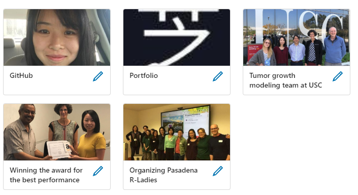
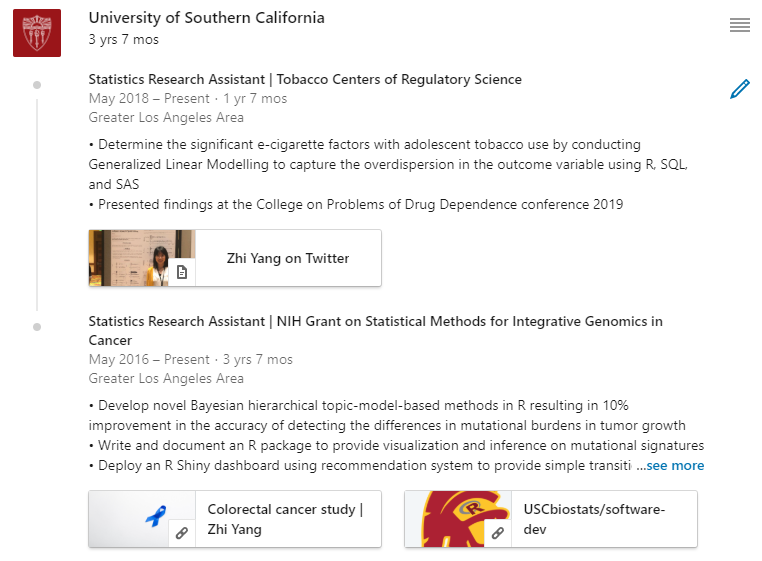
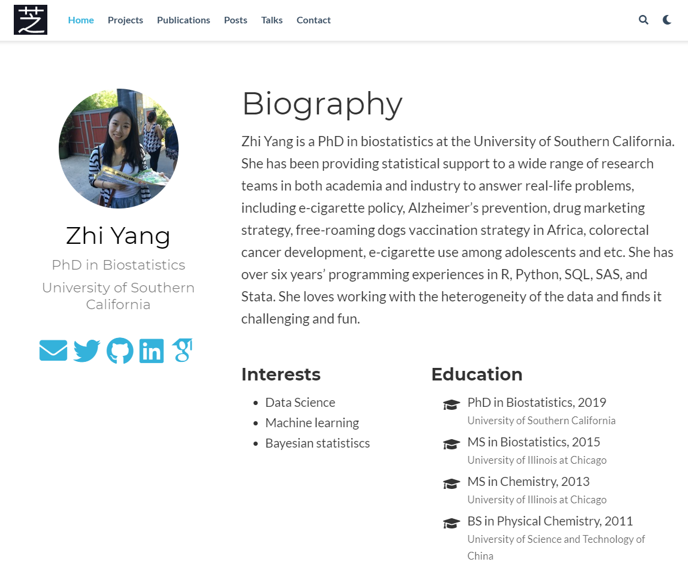
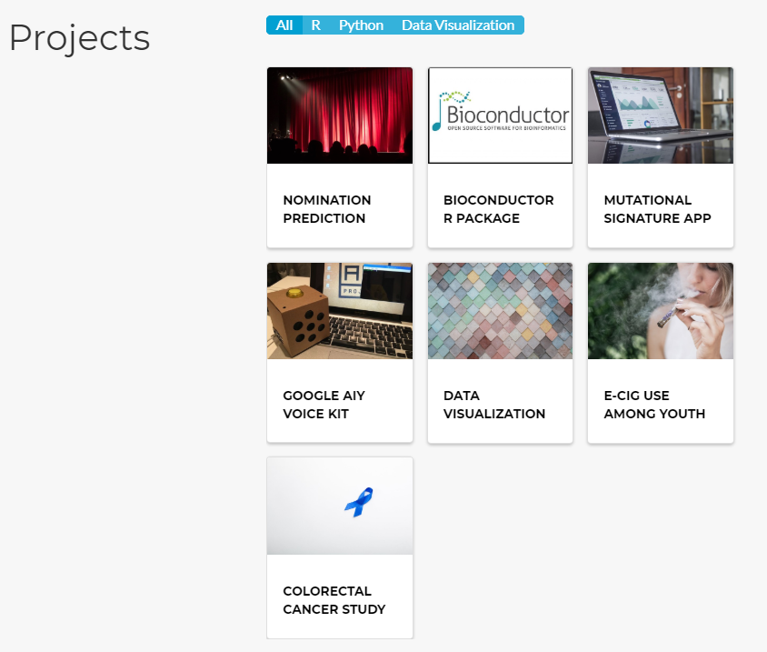
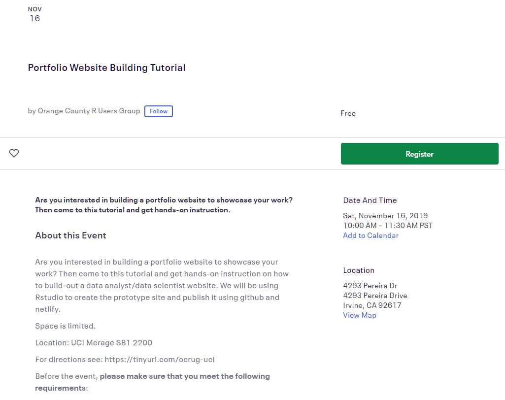
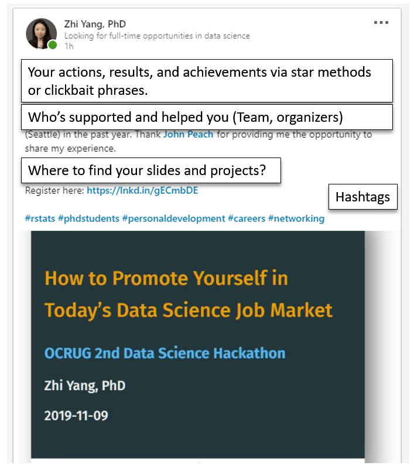
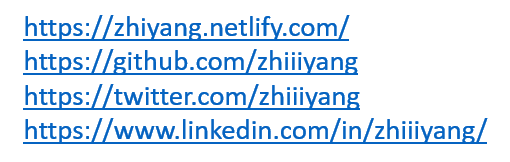
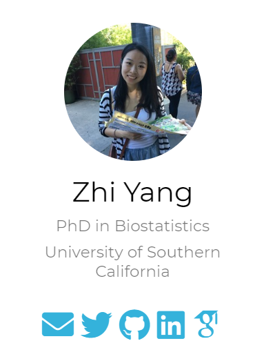
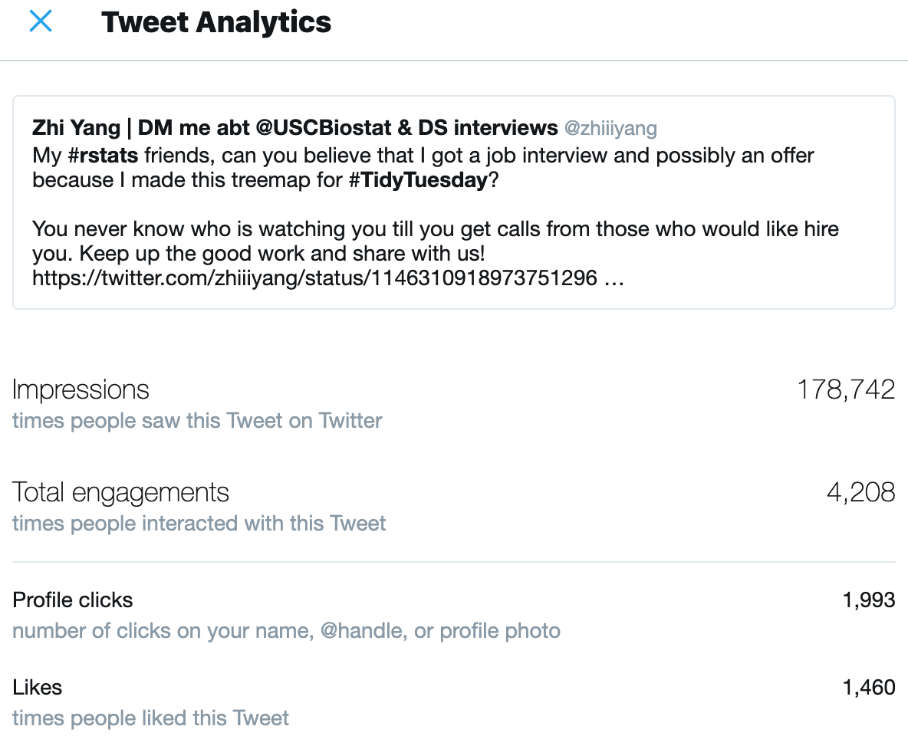
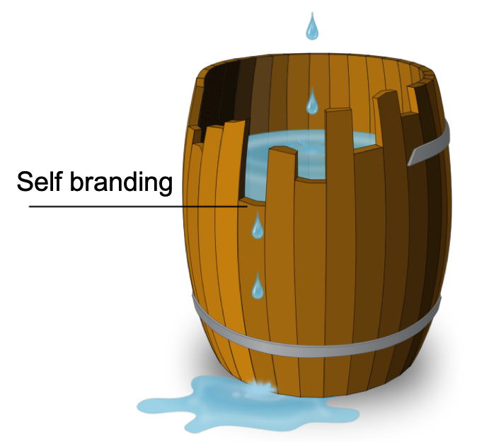

# Who am I to talk about this?

1. PhD in Biostatistics from USC
--

2. Organizer of LA East R Users Group
--

3. International Student from China

--
4. Received DS interview invitations from Google, Microsoft, Amazon, FB

---
class: middle, center, inverse

# I know! Because you have a PhD.

--

<div id="demotext">No!</div>

---

# Unsolved mysteries

<blockquote class="twitter-tweet tw-align-center"><p lang="en" dir="ltr">For the same company, <br>- applied through the online system. Nothing happened. <br>- got referrals from my friend and she talked to the hiring manager. Still nothing. <br>- DM an employee who just visited my LinkedIn page to say hi plus I’m looking for jobs. Got an interview. 🤔</p>&mdash; Zhi Yang | DM me abt @USCBiostat &amp; DS interviews (@zhiiiyang) <a href="https://twitter.com/zhiiiyang/status/1174075656210006016?ref_src=twsrc%5Etfw">September 17, 2019</a></blockquote> <script async src="https://platform.twitter.com/widgets.js" charset="utf-8"></script>


.center[
😟 ATS system hates my resume

🤗 Hiring managers DM me on LinkedIn
]

---
# What I've done in the past year


---

# Introducing three plans 

### 3 months -> internship: 

## .red[LinkedIn + GitHub]

### 3 months -> full-time job: 

## .red[LinkedIn + GitHub + Portfolio]

### more than 3 months: 

## .red[LinkedIn + GitHub + Portfolio + Twitter]

---
class: middle, center, inverse

# What I would do if I am doing a hackathon?

<div id="demotext">A step-by-step stressfree tutorial</div>

---
# First module

1. Sign up for a LinkedIn account
2. Get a professional headshot
3. Use the FREE one-month LinkedIn premium 
4. Connect John and me on LinkedIn

---
# Second module 

1. .medium[Choose where to publish your work]
### GitHub, Azure Notebooks, RPubs, ...

2. .medium[Learn literate statistical programming]
### RMarkdown, Jupyter Notebook

3. .medium[Document your workflow and ideas]
### Notion, Wunderlist, ...

---
# Things to do today 

1. Connect/Endorse ppl on LinkedIn 
--

2. Take a group photo with laptops
--

3. Post a status on LinkedIn 
--

4. Update your profile by tomorrow

---
# Post a status on LinkedIn 
.pull-left[
## Don'ts
### one sentence 

### a photo of yourself

### mention no one 

### no hashtags

### No tagging companies
]

.pull-right[
## Dos
### Action and results

### a photo with your team

### @ your team/organizers

### use buzzwords hashtags

### Tagging all the time
]

---
# .medium[Don't be afraid to tag big companies ]

<blockquote class="twitter-tweet tw-align-center"><p lang="en" dir="ltr">Do I know anyone at <a href="https://twitter.com/Apple?ref_src=twsrc%5Etfw">@apple</a> who can help me expedite a support request? I just spent 90 mins on hold and the best they can do is a call back in 7-14 days 😬 (This after Apple lost my trade in phone and send me someone else’s back)</p>&mdash; Hadley Wickham (@hadleywickham) <a href="https://twitter.com/hadleywickham/status/1192974662550085632?ref_src=twsrc%5Etfw">November 9, 2019</a></blockquote> <script async src="https://platform.twitter.com/widgets.js" charset="utf-8"></script>

## .center[Hadley has 96.2K followers on Twitter]

---
# Update your profile

1. make your headline stand out
### Looking for data science jobs

2. summarize your achievements
### including keywords from job descriptions and cover letters

3. take skill quiz

---
# Update your profile

### add images/links to your summary



---
# Update your profile

### add images/links to your experience



---
# Portfolio website with blogdown


---
# Make a website under 20 mins

<blockquote class="twitter-tweet tw-align-center"><p lang="en" dir="ltr">Thank you for emphasizing the importance of an academic website! <br><br>You can build a website under 20-min using <a href="https://twitter.com/hashtag/blogdown?src=hash&amp;ref_src=twsrc%5Etfw">#blogdown</a> and the <a href="https://twitter.com/hashtag/hugoAcademic?src=hash&amp;ref_src=twsrc%5Etfw">#hugoAcademic</a> template by <a href="https://twitter.com/georgecushen?ref_src=twsrc%5Etfw">@georgecushen</a>. I highly recommend <a href="https://twitter.com/apreshill?ref_src=twsrc%5Etfw">@apreshill</a>&#39;s <a href="https://twitter.com/hashtag/rstudioconf2019?src=hash&amp;ref_src=twsrc%5Etfw">#rstudioconf2019</a> workshop <a href="https://t.co/aBRiC2Bjxk">https://t.co/aBRiC2Bjxk</a> and<a href="https://t.co/HdMOEmT34K">https://t.co/HdMOEmT34K</a></p>&mdash; Zhi Yang | DM me abt @USCBiostat &amp; DS interviews (@zhiiiyang) <a href="https://twitter.com/zhiiiyang/status/1192283605034123264?ref_src=twsrc%5Etfw">November 7, 2019</a></blockquote> <script async src="https://platform.twitter.com/widgets.js" charset="utf-8"></script>

---
# Portfolio website with blogdown



---
# A page dedicated to a project


-----
# FREE 90-min workshop on portfolio building  



---
# Things to do tomorrow 

1. .medium[Take a photo of team presentation/winning]
--

2. .medium[Create sharable links for slides and projects]
--

3. .medium[Post a status on LinkedIn]
--

4. .medium[Write a post on LinkedIn/Medium/blog]

---
# Write a post on LinkedIn  

## What to write about?

What you've achieved? -> I just completed two-day #datascience #hackathon

What you've learned? -> data viz, coding, teamwork, networking, presenting

Who would you thank? -> @ team + organizers 

Why are you posting? -> I'm currently looking for DS internship/full-time jobs

project links + group photos + gif of dataviz

use spaces between paragraphs 

---
# Post a status on LinkedIn



---
# Create an image for your status

## Please don't do the following 
.pull-left[

Show more than one link.


]

.pull-right[

Use non-clickable images.


]
---
# Create an image for your status


### .center[It is made in PowerPoint. No Photoshop is needed.]

---
# .medium[Write a post on LinkedIn/Medium/blog]

### 7 things that I learned from my first hackathon

### What I've learned from winning/failing my first hackathon

### Why and how to attend your first hackathon

### How to win a hackathon as a student

### Hackathon survival guide: sleep

### Announcing the Winners of hackathon 

---
# .medium[How to navigate on LinkedIn premium]

1. Get an all-star profile

2. Connect to LIONs

3. Post relevant contents

4. DM hiring managers

---
# How to DM a hiring manager

1. Type "hiring" in search bar

2. Send a short paragragh 

3. If get replied, always ask to connect 

4. Touch base every 2~3 months

---
# How to DM a hiring manager


---
# Monitor your audiences 


### .center[~2w ago: announcing the events]
### .center[~2m ago: posting a Google AIY project]

---
# Monitor your audiences 


### .center[Who is viewing your status?]

---
# .medium[Twitter impressions]



### .center[Your future employee might be watching you.]

---
# Should I prioritize self branding?



---
# .medium[The Exponential Impact of Social Media] 

```{r echo=FALSE}
library(ggplot2)
df <- data.frame(Time = 1:12, Effect = exp(-(12:1)*0.5))
ggplot(df, aes(Time, Effect)) + 
  geom_line() +
  scale_x_continuous(breaks = c(1, 3, 6, 9, 12), 
                     labels = month.abb[c(1, 3, 6, 9, 12)]) +
  theme(text = element_text(size=20))
  
```


---
class: middle, center, inverse

## How to be good at it?

<div id="demotext">Practice makes perfect</div>

---
# .small[Introducing "all in one" incredible plan]


### .center[Become a social media volunteer today!]

---
class: center, middle

# Thanks! and Keep in touch
<br>

## Follow me on Twitter (@zhiiiyang) 
## Connect me on LinkedIn (@zhiiiyang)

<br>

Slides created via the R package [**xaringan**](https://github.com/yihui/xaringan) and the template from @malco_barrett


