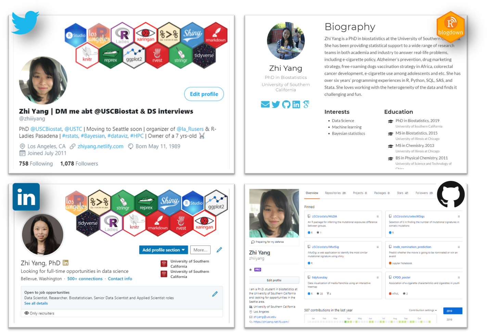
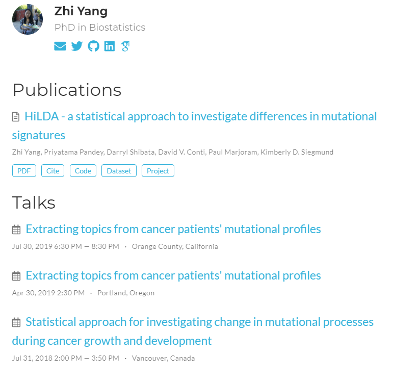

# Who am I to talk about this?

1. PhD in Biostatistics from USC
--

2. Organizer of LA East R Users Group
--

3. International Student from China

--
4. Received DS interview invitations from Google, Microsoft, Amazon, FB

---
class: middle, center, inverse

# I know! Because you have a PhD.

--

No!

---

# Unsolved mysteries

<blockquote class="twitter-tweet tw-align-center">
For the same company,  - applied through the online system. Nothing happened.  - got referrals from my friend and she talked to the hiring manager. Still nothing.  - DM an employee who just visited my LinkedIn page to say hi plus I’m looking for jobs. Got an interview. 🤔
&mdash; Zhi Yang | DM me abt @USCBiostat &amp; DS interviews (@zhiiiyang) <a href="https://twitter.com/zhiiiyang/status/1174075656210006016?ref_src=twsrc%5Etfw">September 17, 2019</a></blockquote> 

.center[
😟 ATS system hates my resume

🤗 Hiring managers DM me on LinkedIn
]

---
# What I've done in the past year

---

# Introducing three plans 

### 3 months -> internship: 

## .red[LinkedIn + GitHub]

### 3 months -> full-time job: 

## .red[LinkedIn + GitHub + Portfolio]

### more than 3 months: 

## .red[LinkedIn + GitHub + Portfolio + Twitter]

---
class: middle, center, inverse

# What I would do if I am doing a hackathon?

A step-by-step stressfree tutorial

---
# First module

1. Sign up for a LinkedIn account
2. Get a professional headshot
3. Use the FREE one-month LinkedIn premium 
4. Connect John and me on LinkedIn

---
# Second module 

1. .medium[Choose where to publish your work]
### GitHub, Azure Notebooks, RPubs, ...

2. .medium[Learn literate statistical programming]
### RMarkdown, Jupyter Notebook

3. .medium[Document your workflow and ideas]
### Notion, Wunderlist, ...

---
# Things to do today 

1. Connect/Endorse ppl on LinkedIn 
--

2. Take a group photo with laptops
--

3. Write a post on LinkedIn
--

4. Update your profile by tomorrow

---
# Write a post on LinkedIn
.pull-left[
## Don'ts
### one sentence 

### a photo of yourself

### mention no one 

### no hashtags
]

.pull-right[
## Dos
### Action and results

### a photo with your team

### @ your team/organizers

### use buzzwords hashtags
]

---
# Update your profile

### make your headline stand out
Looking for data science jobs

### summarize your achievements
including keywords from job descriptions and cover letters

### take skill quiz

---
# Update your profile

### add images/links to your summary

---
# Update your profile

### add images/links to your experience

---
# Portfolio website with blogdown

---
# Make a website under 20 mins

<blockquote class="twitter-tweet tw-align-center">
Thank you for emphasizing the importance of an academic website!   You can build a website under 20-min using <a href="https://twitter.com/hashtag/blogdown?src=hash&amp;ref_src=twsrc%5Etfw">#blogdown</a> and the <a href="https://twitter.com/hashtag/hugoAcademic?src=hash&amp;ref_src=twsrc%5Etfw">#hugoAcademic</a> template by <a href="https://twitter.com/georgecushen?ref_src=twsrc%5Etfw">@georgecushen</a>. I highly recommend <a href="https://twitter.com/apreshill?ref_src=twsrc%5Etfw">@apreshill</a>&#39;s <a href="https://twitter.com/hashtag/rstudioconf2019?src=hash&amp;ref_src=twsrc%5Etfw">#rstudioconf2019</a> workshop <a href="https://t.co/aBRiC2Bjxk">https://t.co/aBRiC2Bjxk</a> and<a href="https://t.co/HdMOEmT34K">https://t.co/HdMOEmT34K</a>
&mdash; Zhi Yang | DM me abt @USCBiostat &amp; DS interviews (@zhiiiyang) <a href="https://twitter.com/zhiiiyang/status/1192283605034123264?ref_src=twsrc%5Etfw">November 7, 2019</a></blockquote> 

---
# Portfolio website with blogdown

---
# A page dedicated to a project

-----
# FREE 90-min workshop on portfolio building  

-
# Things to do tomorrow 

### Take a photo of team presentation/winning

### WriCreate sharable links for slides and projects

### te a post on LinkedIn 

---### Write a blog on LinkedIn, Medium, or your blog

---
# Write a post on LinkedIn  

# .small[Introducing "all in one" incredible package]

--
class: center, middle

# Thanks! and Keep in touch
 

### `r icon::fa("twitter")` [@zhiiiyang](https://twitter.com/zhiiiyang)
### `r icon::fa("github")`  [zhiiiyang](https://github.com/zhiiiyang)
### `r icon::fa("envelope")`  [zyang895@gmail.com](mailto:zyang895@gmail.com)

 

Slides created via the R package [**xaringan**](https://github.com/yihui/xaringan) and the template from @malco_barrett

